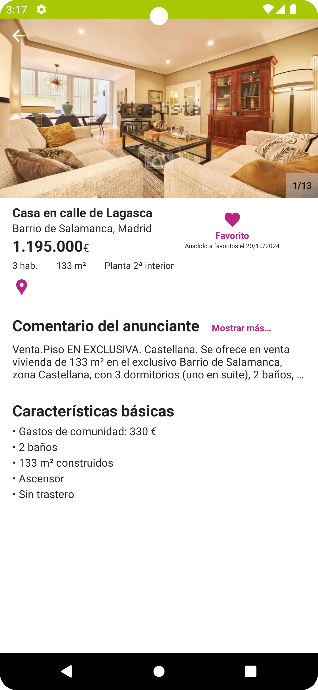
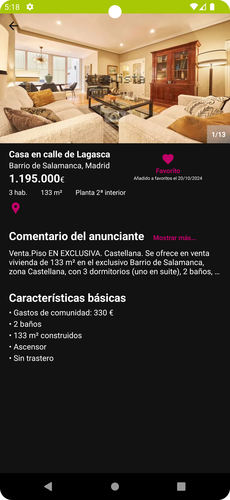
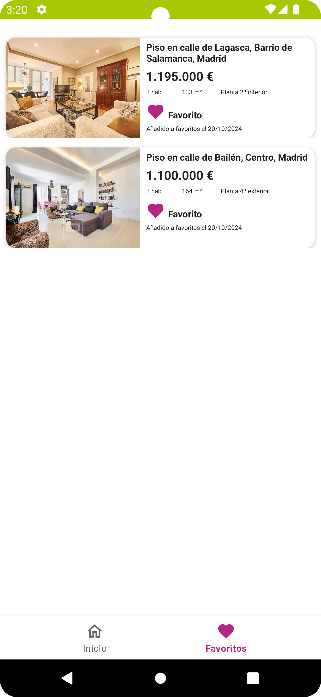
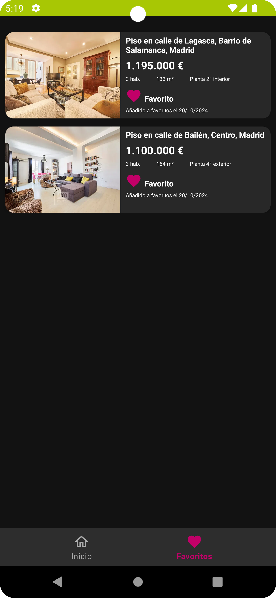
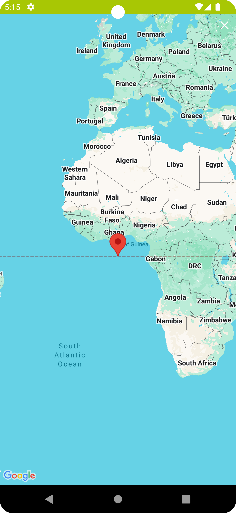
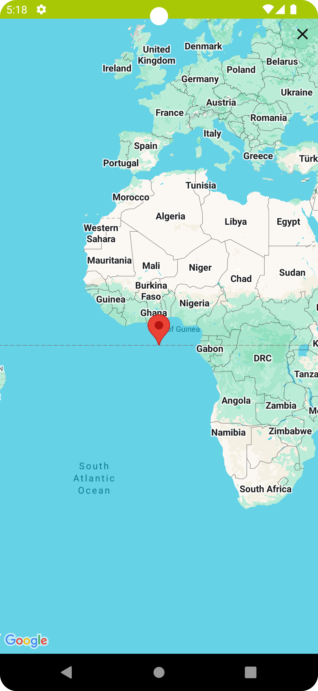

# Android Technical Challenge - Idealista

### This application is a technical test for Idealista. The full description and requirements of the test can be found here: [Idealista's repository](https://github.com/idealista/android-challenge).

## Description

An Android application that allows users to explore apartment listings, view detailed information,
add apartments to favorites, and view the location on a map. The application supports dark mode and
is developed using Jetpack Compose for the apartment list screen and XML for the rest, following a
clean architecture with MVVM and modularization.

## Features

- **Home**: List of apartment listings with basic details and an option to add to favorites.
- **Apartment Detail**: Detailed information about the selected apartment, with options to add or
  remove from favorites and view on a map.
- **Favorites**: List of apartments marked as favorites by the user.
- **Map**: Displays the apartment's location on an interactive map.
- **Dark Mode**: Full support for light and dark themes.

## Screenshots

|                     Home Screen                      |                    Home Screen (Dark)                     |                    Apartment Detail                    |                      Apartment Detail                       |     
|:----------------------------------------------------:|:---------------------------------------------------------:|:------------------------------------------------------:|:-----------------------------------------------------------:|
|  |  |  |  |

|                         Favorites                         |                           Favorites                            |                      Map View                       |                         Map View                         |
|:---------------------------------------------------------:|:--------------------------------------------------------------:|:---------------------------------------------------:|:--------------------------------------------------------:|
|  |  |  |  |

## Technologies and Libraries Used

- **Kotlin**: Primary programming language.
- **Jetpack Compose**: Used for the Home screen.
- **XML Layouts**: Used for the other screens.
- **MVVM Architecture**: For clear separation of concerns.
- **Modularization**: Project divided into modules for better scalability and maintenance.
- **Android Jetpack Libraries**: ViewModel, LiveData, Navigation, etc.
- **Google Maps API**: For map visualization.
- **Room Database**: For storing favorite apartments.
- **Retrofit**: For network requests.
- **Coil**: For image loading.

## Architecture

The application follows the clean architecture pattern with MVVM, which facilitates maintenance and
scalability of the project. Modularization allows for a logical separation of components and
functionalities.

## Project Structure

- **app**: Contains the base configuration and navigation.
- **data**: Manages data sources and repositories.
- **domain**: Contains use cases and domain models.
- **presentation**: Includes main activity, fragments, xml views and composables.

## Installation and Execution

1. **Clone the repository**:

    ```bash
    git clone https://github.com/Angelglpz/android-challenge.git
    ```

2. **Open in Android Studio**:

- Import the project into Android Studio.
- Ensure you have the appropriate Android SDK installed.

3. **Add Google Maps API Key**:

- Obtain a Google Maps API key from
  the [Google Cloud Platform Console](https://console.cloud.google.com/).

- Add your Google Maps API key to the `local.properties` file:

    ```properties
    MAPS_API_KEY="YOUR_API_KEY"
    ```

4. **Sync dependencies**:

- Sync the project with Gradle to download all necessary dependencies.

5. **Run the application**:

- Connect an Android device or use an emulator.
- Run the project from Android Studio.

## Prerequisites

- **API Level**: 24 (Android 7.0 Nougat) or higher.
- **Internet Connection**: To load the apartment listings data.

## Implementation Decisions

- For displaying a carousel of images with "infinite" scrolling, I implemented a **circular list**
- To avoid unnecesary emits from **LiveData**, I implemented a **SingleLiveEvent** class, which is a
  **LiveData** that only emits once.

## Notes

### Handling Incomplete API Responses

- Since the response from [details.json](https://idealista.github.io/android-challenge/detail.json)
  is incomplete and does not provide
  consistent data with the response
  from [list.json](https://idealista.github.io/android-challenge/list.json), the detail screen
  must retrieve essential information, such as the property address and other relevant data, from
  the previous screen.
  In a real-world implementation, the detail API should return all necessary information to simplify
  the development process and ensure that the application can seamlessly display detailed content
  without relying on the previous screen's data.
- To closely align with the current Idealista application, I have set the minimum API level to 24.

## Contact

For questions or suggestions:

- **Email**: [angelgarciamoratalla98@gmail.com](mailto:angelgarciamoratalla98@gmail.com)
- **GitHub**: [Angelglpz](https://github.com/angelglpz)

